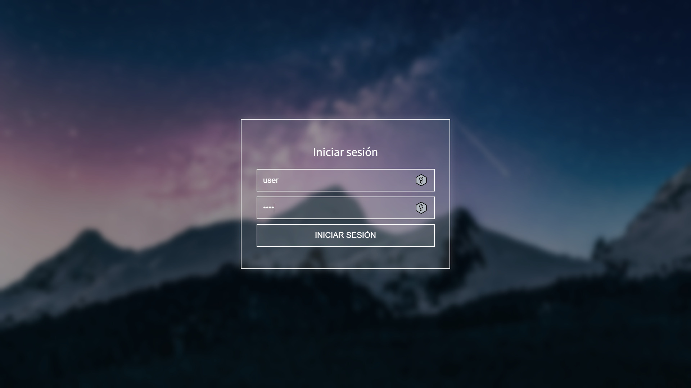
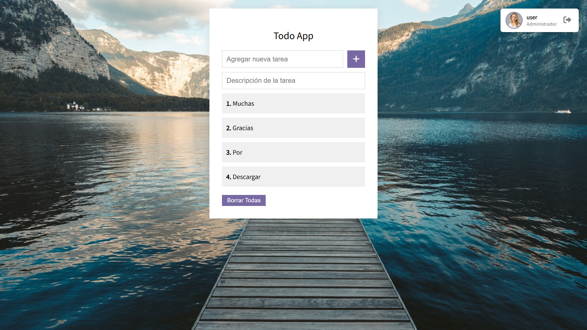

# 📋 ToDo App — Sistema de Gestión de Tareas

> 🛠️ Desarrollado por **Patrick Joel Sarmiento**  

---

## 🌟 ¿Qué es este proyecto?

**ToDo App** es una aplicación web sencilla y funcional que permite a los usuarios autenticarse, crear, editar y eliminar tareas. Está diseñada con un enfoque educativo y modular, y se adapta tanto a entornos locales como a servidores en producción.

---

## 🧠 Funcionalidades principales

- ✅ Login seguro con validación PHP + JSON
- 🗂️ Creación, visualización, edición y eliminación de tareas
- 🗑️ Borrado masivo de todas las tareas
- 🧍 Visualización personalizada del usuario con nombre y foto
- 🚪 Logout con cierre de sesión y retorno a la página de inicio

---

## 🧰 Tecnologías utilizadas

| Tecnología          | Uso principal                             |
|---------------------|-------------------------------------------|
| HTML5 / CSS3        | Estructura y estilos                      |
| JavaScript / jQuery | Interacción dinámica (AJAX, drag & drop)  |
| PHP                 | Backend, manejo de sesiones y lógica      |
| JSON                | Almacenamiento de usuarios y tareas       |
| Font Awesome 6      | Iconografía moderna                       |

---

## 📁 Estructura del proyecto

```
todo-app/
├── backend/
│   ├── login.php
│   ├── logout.php
│   ├── api.php
│   ├── usuarios.json
│   ├── tareas.json
│   └── logs/
│       └── debug.log
├── frontend/
│   ├── index.html
│   ├── tareas.php
│   ├── css/
│   │   └── style.css
│   ├── js/
│   │   ├── login.js
│   │   └── tareas.js
│   └── img/
│       ├── fondo.jpg
│       ├── usuario.jpg
│       └── login.jpg
└── README.md
```

---

## 🚀 ¿Cómo usar la aplicación?

1. **Abrir `index.html`** en el navegador.
2. **Ingresar con un usuario válido** del archivo `usuarios.json`.
3. Tras login exitoso, accederás a `tareas.php`.

---

## 🧪 ¿Cómo se crean tareas?

1. Escribe un **título** y una **descripción** en el formulario.
2. Pulsa ➕ para agregar.
3. Las tareas se almacenan en `tareas.json`.

---

## ✏️ ¿Cómo editar una tarea?

1. Haz clic en cualquier tarea.
2. Pulsa ✏️ para editar.
3. Cambia título o descripción y guarda con ✔️.

---

## ❌ ¿Cómo borrar tareas?

- Pulsa 🗑️ sobre una tarea para eliminarla individualmente.
- Pulsa **"Borrar todas"** para vaciar todo el archivo `tareas.json`.

---

## 🔐 ¿Cómo se maneja el login?

- Los usuarios están definidos en `usuarios.json`:

```json
[
  {
    "usuario": "user",
    "password": "user",
    "nombre": "user"
  }
]
```

- Se validan mediante `login.php` usando sesiones.

---

## 📸 Capturas de pantalla

*Inserta aquí tus imágenes, por ejemplo:*

```


```

---

## 🧹 Cierre de sesión (Logout)

Pulsa el botón 🚪 de la parte superior derecha para cerrar la sesión y volver a `index.html`.

---

## 🧩 Futuras mejoras

- ✅ Soporte para usuarios múltiples con roles
- 🔄 Sincronización en tiempo real (WebSockets)
- 📲 Versión móvil responsive
- 🔐 Encriptación de contraseñas
- ☁️ Almacenamiento en base de datos SQL

---

## 🪪 Licencia

Este proyecto puede distribuirse bajo la **MIT License**.

---

## 🙌 Créditos

- 👨‍💻 **Patrick Joel Sarmiento**

---

> 🧠 *“La organización es la clave del éxito” — Este ToDo App es tu primer paso hacia la excelencia en la gestión de tareas.*
